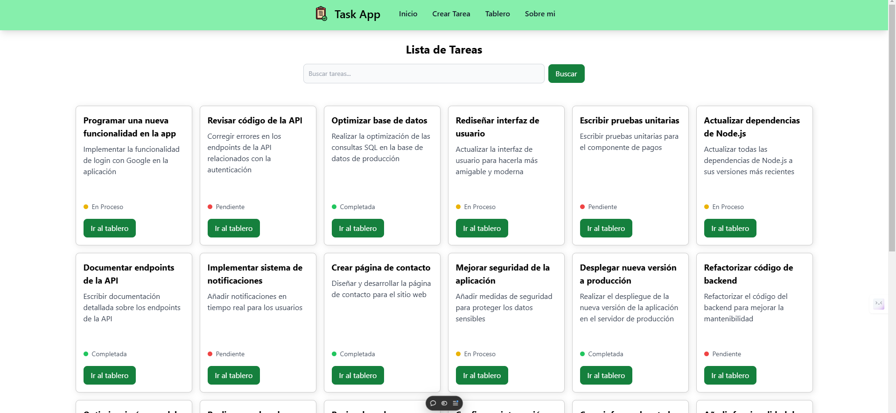
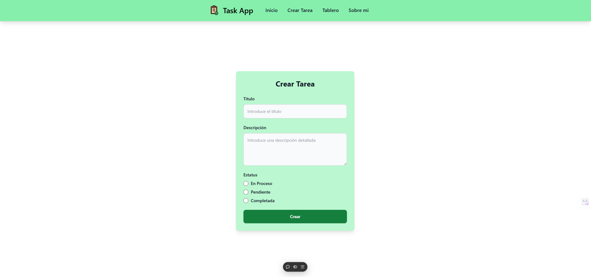
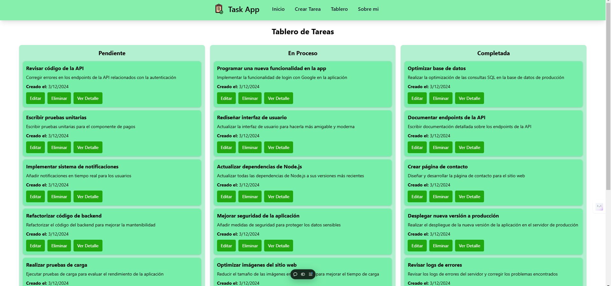

# Prueba tecnica Ludik Full Stack

Se realizo una un app full Stack de tareas usando node y express en el back y en el front Nuxt.js

# Back: instrucciones
Para levantar el proyecto por el lado de back, se debe crear una base de datos en MongoDB y a su ves crear un archivo .env en la raiz del proyecto. se debe pegar esta variable dentro del archivo colocando el "mongo url" generado por mongo con el siguiente formato:
```
MONGODB_URI_PROD= "Tu mongo url"

// base de datos creada con fines de prueba

``` 

O en caso contrario de ahorrar tiempo se debe tener instalado docker en su computadora y ejecutar el siguiente comando:

```
docker-compose up -d

```

comando el cual levantara una base de datos virtualizada con la configuracion ya realizada en el archivo docker-compose.yaml que debe verse de esta forma:

```
version: '3'

services:
  db:
    image: mongo:5.0.0
    restart: always
    ports:
      - 27017:27017
    environment:
      MONGO_DATABASE: tasks-api  
    volumes:
      - ./mongo:/data/db

```

y se debe colocar en la variable del archivo .env el siguiente valor
```
MONGODB_URI_DEV= mongodb://localhost:27017/tasks-api

``` 
por ultimo se debe escribir en la terminal el siguiente comando para instalar las dependencias necesarias
```
npm install

```
una ves realizados cualquiera de estos pasos la base se levanta colocando cualquiera de estos 2 comandos en la consola

```
npm run dev
npm start

# Recomendacion: Trabajar con el comando "dev" cuando se esta trabajando con docker y con el comando "start" cuando usamos una base de datos real

```

## Endpoints
el back contiene los siguientes Endpoints.
```
 http://localhost:3001/api/seed // seed para poblar la base de datos (GET)
 http://localhost:3001/api/createTask // crear tareas (POST)
 http://localhost:3001/api/getTaskAll // traer todas las tareas (GET)
 http://localhost:3001/api/getTaskById/:id // filtrar una tarea por id (GET)
 http://localhost:3001/api/getTaskByStatus/:status // filtrar una tarea por status (GET)
 http://localhost:3001/api/updateTask/:id // actualizar una tarea (PUT)
 http://localhost:3001/api/deleteTask/:id // eliminar una tarea (DELETE)

``` 
para mayor comodidad se deployo para tener una vista de prueba de los Endpoints.


# Front: Instrucciones

Para levantar el front de debe instalar la dependencias necesarias con el siguiente comando:
```
npm install
```
Despues se debe crear un archivo .env copiando la siguente variable:

```
NUXT_ENV_APP_URL= https://back-task-parte1.vercel.app
```
### NOTA:  Se esta usando el back deployado 
una ves terminado esto se levanta el proyecto con 
```
npm run dev
```
Para visualizar mejor el front tambien se deployo para poder visualizarlo mejor

# Mejoras Implementadas

## Back
Por el lado del backend de implementaron encabezados de seguridad para proteger los Endpoints de posibles ataques.

```
router.use(helmet());

```

A la par se implemento un array para la validacion y sanitización de datos
```
const validateTask = [
    body("title").isString().trim().escape(),
    body("description").isString().trim().escape(),
    body("status").isString().trim().escape()
];
```

y por ultimo se coloco  una configuracion Configuración de CSP para prevenir ataques 
como el Cross-Site Scripting (XSS) y otros tipos de inyecciones de contenido no deseado.

```
router.use((req, res, next) => {
    res.setHeader(
        "Content-Security-Policy",
        "default-src 'self'; connect-src 'self' http://localhost:3000 https://back-task-parte1.vercel.app/api/getTaskAll https://back-task-parte1.vercel.app https://front-part-1-j3az6ff6r-emapauls-projects.vercel.app https://front-part-1.vercel.app' ;"
    );
    next();
});
```

# Front
Para el front se aplico mejoras, como el manejo de errores y el debounce de busqueda para ubicar de forma mas precisa las tareas, aplicando a su ves tailwind para darle estilos mas presentables a la pagina utilizando un poco de css a la par. Implementando a su ves algunos efectos para la decoracion de la pagina.

# Links

### link de los deploys
link del front: https://front-part-1.vercel.app

link del back: https://back-task-parte1.vercel.app

### Repositorio de los deploys:
front: https://github.com/EmaPaul/front_part_1

back: https://github.com/EmaPaul/back-task-parte1

# Capturas

### Inicio


### formulario de crear tareas


### Tablero
